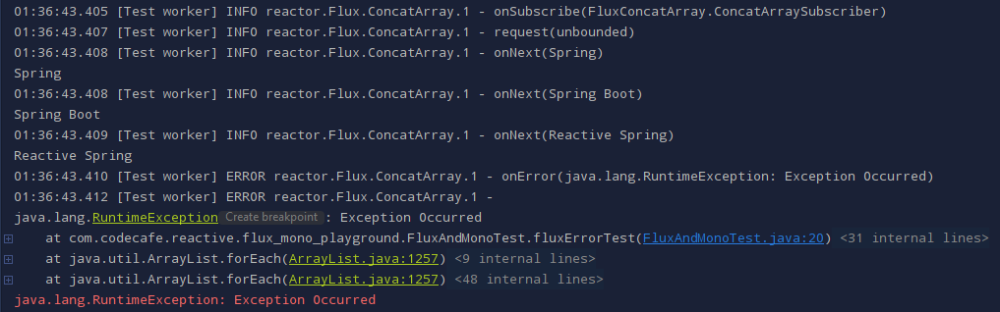

# Project Reactor

https://projectreactor.io/

Project Reactor 3.x is a library that is built around the Reactive Streams specification,
bringing the reactive programming paradigm to JVM.

> Reactor is a full, non-blocking reactive programming framework that manages back
> pressure and integrates interaction with the Java 8 functional APIs (CompletableFuture,
> Stream, and Duration)

* reactor-core
  - core library for Project Reactor
  - requires Java 8 (minimum)
  - Flux and Mono are the Reactive Types of the Project Reactor
* reactor-test
* reactor-netty

## Spring WebFlux

Spring WebFlux was added in Spring 5.0

It is a fully non-blocking framework that relies on Project Reactor, which supports reactive streams back pressure
and runs on servers like Netty and Undertow, and Servlet 3.1+ containers.

### Reactor provides two reactive composable asynchronous APIs:

## [Flux](Flux "https://projectreactor.io/docs/core/release/api/reactor/core/publisher/Flux.html") [N] (for N elements)

```java
public abstract class Flux<T>
extends Object
implements CorePublisher<T>
```

* A Reactive Streams Publisher with rx operators that emits 0 to N elements, and then completes (successfully or with an error).

* Flux represents 0 to N elements.


## Code samples:

### Success


### Error




## [Mono](Mono "https://projectreactor.io/docs/core/release/api/reactor/core/publisher/Mono.html") [0|1] (for 0 or 1 elements)

```java
public abstract class Mono<T>
extends Object
implements CorePublisher<T>
```

* A Reactive Streams Publisher with basic rx operators that emits at most one item via the onNext signal then terminates with an onComplete signal (successful Mono, with or without value), or only emits a single onError signal (failed Mono).
* Mono represents 0 to 1 elements.


## Code samples:

### Success


### Error


