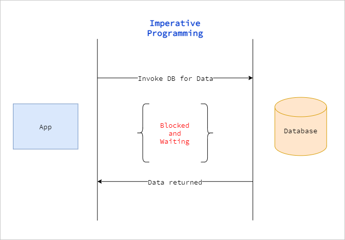
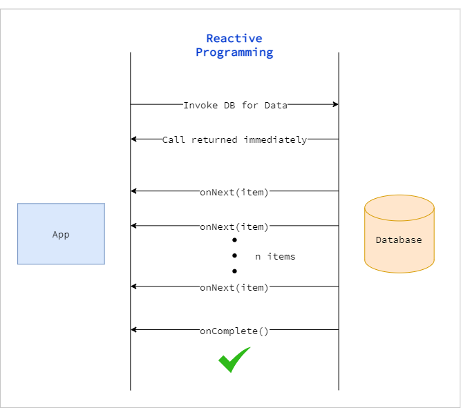
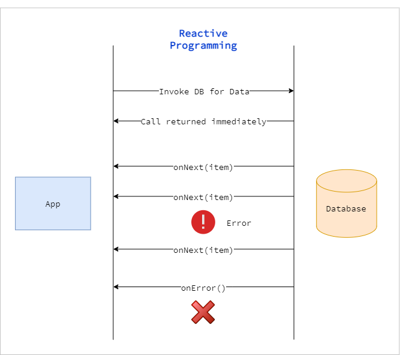
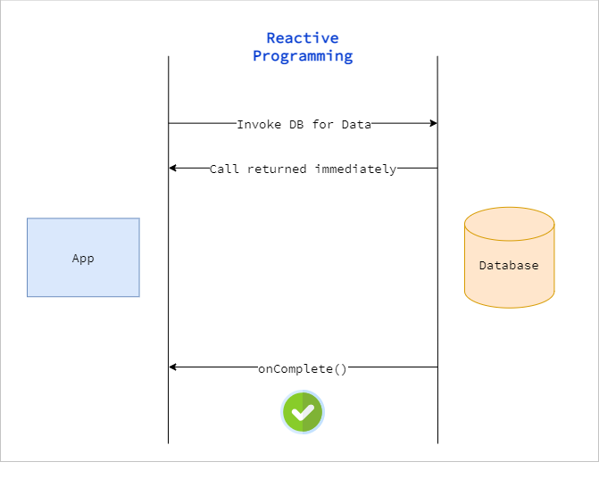

# Reactive Programming

* New programming paradigm
* Asynchronous and non-blocking by nature
* Data flow as an **Event/Message driven** stream otherwise known as a **Reactive Stream**.
* Functional style code
* Supports **Back Pressure** on Data Streams

A real world example could be two persons chatting on WhatsApp.

* Person1 sends a message to Person2 and then continues to do his other work.
* Person2 may send a reply after a while and carry on his work as well.
* They both can come online at the same time and chat for a while.
* Their conversation is totally non-blocking.

# Imperative Programming vs Reactive Programming

## Imperative Programming

Consider the following code to retrieve data from the DB:

```java
List<Item> items = itemRepository.getAllItems();
```



## Reactive Programming

Reactive Programming supports `Back-Pressure` on Data Streams.

If the data source is producing more data than we expect then there is a way our Application can provide a feedback
to the data source stating "you need to slow down until I catch up".

Data flows as an an Event/Message driven stream.

There are three flows:

1. Data flow
2. Error flow
3. No Data flow

These are translated to below methods:

1. onNext(item) - for Data Stream event
2. onComplete() - for Completion/Success event
3. onError() - for Error event

## Success flow


## Error flow


## No Data flow


# More About Reactive Programming

* [Reactive Stream Specification](./reactive-stream-specification.md "Reactive Stream Specification")