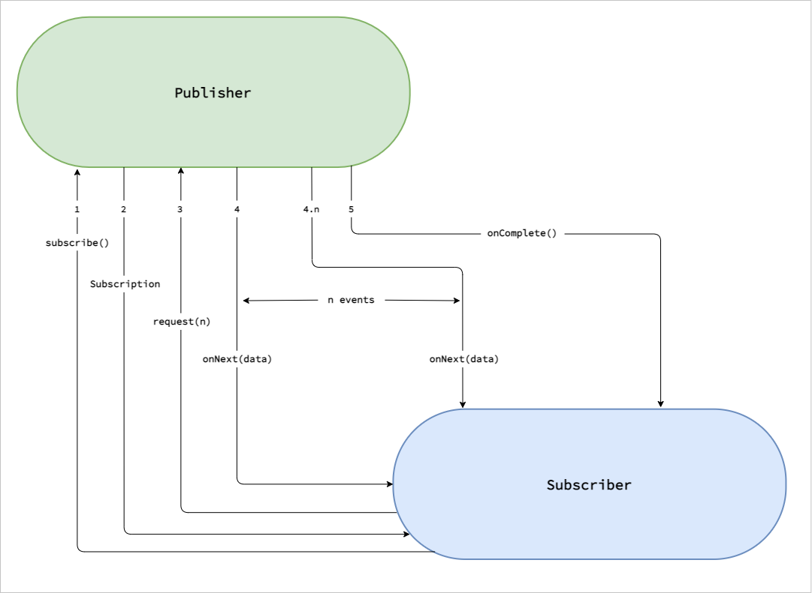
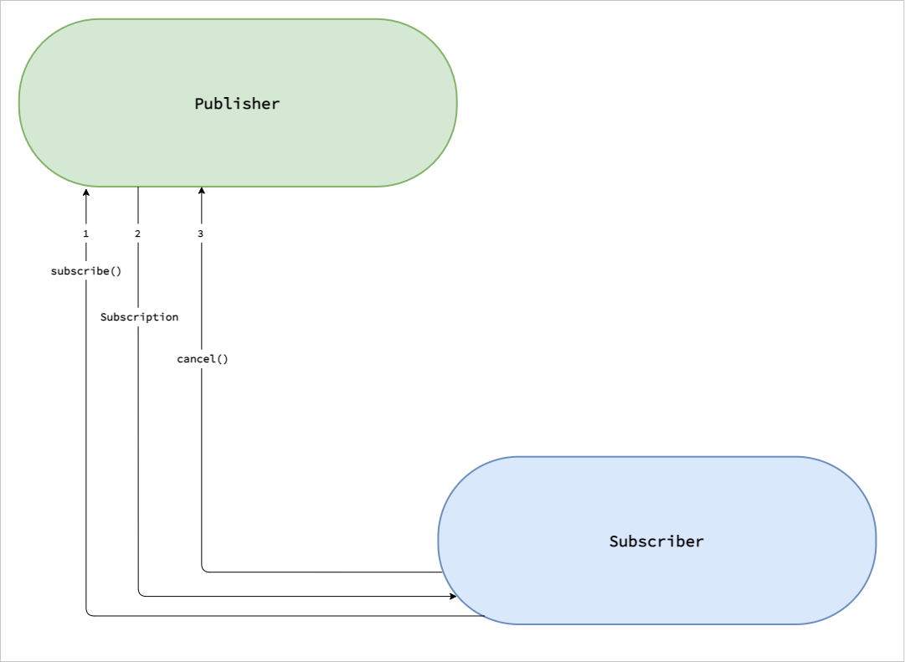

# Reactive Streams Specification

Specification or Rules for Reactive Streams.

https://github.com/reactive-streams/reactive-streams-jvm

##Who created the specification?
Engineers from Kaazing, Lightbend, Netflix, Pivotal, Red Hat, Twitter and many others.

The specification has 4 interfaces:

1. Publisher
2. Subscriber
3. Subscription
4. Processor


## Publisher

```java
public interface Publisher<T> {
    public void subscribe(Subscriber<? super T> s);
}
```

Publishers are generally the Data Source.

Using the subscribe() method, a Subscriber registers itself to the Publisher.

## Subscriber

```java
public interface Subscriber<T> {
    public void onSubscribe(Subscription s);
    public void onNext(T t);
    public void onError(Throwable t);
    public void onComplete();
}
```

## Subscription

```java
public interface Subscription {
    public void request(long n);
    public void cancel();
}
```

## Processor

It is nothing but the combination of both the Subscriber and the Publisher interfaces.

```java
public interface Processor<T, R> extends Subscriber<T>, Publisher<R> {
}
```

# Publisher Subscriber Event flow - Request Data


# Publisher Subscriber Event flow - Cancel Subscription


# Reactive Libraries

Reactive libraries provide the implementation of the Reactive Streams Specification.

Few of the libraries are:

1. RxJava
2. [Reactor or Project Reactor](./project-reactor.md "Project Reactor")
   * Built and maintained by **Pivotal** (the team behind Spring and Spring Boot)
   * Default library that comes in Sprint Boot to write Reactive Code
3. Flow Class - JDK 9